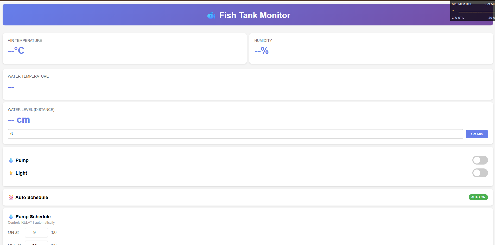
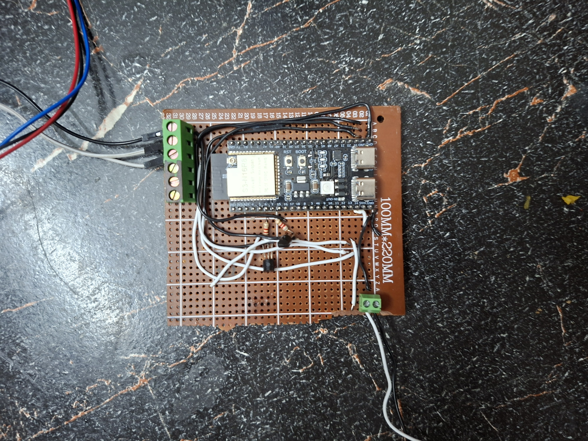

# Fish Tank Automation System

An Arduino-based IoT system for automated monitoring and control of aquariums. Features real-time sensor data, web dashboard, scheduled automation, and persistent state management.

**Web Dashboard Screenshot**


## Features

- **Real-time Monitoring**: Air temperature, humidity, water temperature, and water level
- **Web Dashboard**: Responsive interface accessible from any device on the network
- **Automated Control**: Scheduled on/off times for pump and light relay
- **Persistent Settings**: Settings saved to ESP32's EEPROM and survive reboots
- **Status Feedback**: RGB LED indicator shows system health at a glance
- **Authentication**: Cookie-based login to protect dashboard access
- **mDNS Support**: Access via `http://fish.local` instead of IP address

## Hardware

### Components Required

- ESP32 microcontroller
- DHT11 temperature & humidity sensor
- DS18B20 waterproof temperature sensor
- HC-SR04 ultrasonic distance sensor
- 2x 5V relay module (for pump and light control)
- RGB LED (built-in on ESP32)
- Jumper wires, breadboard (or perfboard for permanent installation)

### Pin Configuration

```
DHT11:     GPIO 5
DS18B20:   GPIO 4
HC-SR04:
  - Trig:  GPIO 15
  - Echo:  GPIO 16
Relay 1:   GPIO 6 (Pump)
Relay 2:   GPIO 7 (Light)
RGB LED:   GPIO 48 (built-in)
```

## Quick Start

1. **Hardware Setup** → See [SETUP.md](./SETUP.md) for detailed wiring instructions
2. **Firmware Upload** → Upload `sketch.ino` to ESP32
3. **WiFi Configuration** → Update SSID and password in code (lines 11-12)
4. **Access Dashboard** → Open `http://fish.local` in your browser (or use IP address)
5. **Login** → Default password is `volt`

## Usage

### Dashboard Controls

- **Temperature/Humidity/Water Levels**: Real-time sensor readings
- **Pump Toggle**: Manual control of water pump relay
- **Light Toggle**: Manual control of light relay
- **Auto Schedule**: Set automatic on/off times (24-hour format)
- **Water Level Threshold**: Set minimum water distance before warning

### Serial Debugging

All sensor readings and warnings are logged to Serial (115200 baud). Connect via USB to monitor:

```
DHT11 - Temp: 22.5°C, Humidity: 65.2%
DS18B20 - Water Temp: 24.3°C
HC-SR04 - Water Level: 8.5 cm
WARNING: Water level too low! Distance: 12.3 cm (should be under 10.0 cm)
```

## Configuration

Edit these constants in the code to customize thresholds:

```cpp
#define TEMP_MIN 20.0           // Minimum air temperature (°C)
#define TEMP_MAX 25.0           // Maximum air temperature (°C)
#define WATER_TEMP_MIN 21.0     // Minimum water temperature (°C)
#define WATER_TEMP_MAX 28.0     // Maximum water temperature (°C)
#define HUMIDITY_MAX 80.0       // Maximum humidity (%)
```

WiFi credentials (required):

```cpp
const char* ssid = "YOUR_SSID";
const char* wifi_password = "YOUR_PASSWORD";
const char* LOGIN_PASSWORD = "volt";  // Change this!
```

## Troubleshooting

**Dashboard won't load?**
- Make sure you are using `http://` instead of `https://`
- Check WiFi connection: Look for "WiFi Connected!" in Serial monitor
- Try accessing via IP address instead of `fish.local`
- Verify you're using the correct login password

**Sensor readings showing as `--`?**
- Check wiring matches pin configuration above
- Verify sensor is powered (DHT11 and DS18B20 need GND and 5V)
- Check serial monitor for "ERROR" messages

**Water level sensor not working?**
- HC-SR04 needs 5V supply (not 3.3V from ESP32)
- Ensure TRIG and ECHO pins are correctly wired
- Clean sensor face; objects blocking signal will cause errors

**Settings not saved after reboot?**
- Preferences API requires valid partition; should work out of the box
- If it fails, check serial monitor for Preferences errors

## Project Structure

```
fish-monitoring-esp32/
├── README.md                (this file)
├── SETUP.md                 (hardware wiring guide)
├── sketch.ino    (main firmware)
├── parts-list.txt
└── wiring-diagram.txt
```

## Future Improvements

- Add temperature control logic (heating/cooling relays)
- Cloud data logging and analytics
- Mobile app for remote monitoring
- MQTT integration for home automation systems
- Custom time zones (currently hardcoded to PKT)

## License

MIT

## Notes
Trigger pin of ultrasonic sensor works fine but is a little finnicky with the 3.3V signals from the esp32. But it is mandatory to add a voltage divider on the Echo pin or the sensor will output 5V which would fry the microcontroller if a voltage divider isn't used.

## Project Gallery

**Hardware Setup**


**Web Dashboard**

- All times are in Pakistan Standard Time (PKT = UTC+5)
- Water level is measured as distance from sensor; lower = higher water
- RGB LED: Rainbow = healthy, Orange = warning/error condition
- Default login password is weak — change it before exposing to public network
